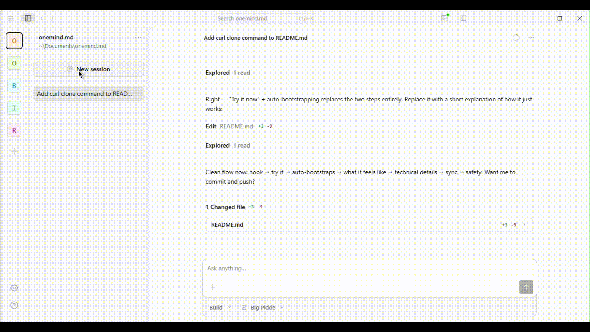

# ONEMIND.md

**A one-file spec that gives your git repo a memory — using only git plumbing.**

Your AI agent records decisions, rejected ideas, and context as git objects on a hidden ref. The
memory lives alongside your code, versioned with it. No extra database, no extra service.

## Try it now

Tell your agent:

> Implement https://github.com/lazardanlucian/onemind.md

Or for any system (not just git):

> Implement https://github.com/lazardanlucian/ONEMIND-DIY.md

## Why

- **"Why did we do it this way?"** — one `git log` away, forever.
- **"What did we try and reject?"** — so nobody re-litigates dead ends.
- **"What did the last agent figure out?"** — next session picks up where it left off.
- It travels with the repo. Clone it, you get the mind.

## Safety & limits

- Nothing in your working tree — no `mind/` folder, no `.gitignore` edits.
- Never commit secrets, tokens, or PII to the mind.
- Append only. Past thoughts are corrected with `git notes`, never rewritten.
- Soft size limit (default 1GB). Agents prune stale thoughts; `git gc` reclaims space.

## This is the git implementation

ONEMIND.md uses git plumbing (`commit-tree`, `update-ref`, `notes`, `bundle`) to store thoughts on
a hidden ref (`refs/mind/main`). It never touches your branches — your commits, your working tree,
and your `git status` are completely unaffected. See [`ONEMIND-DIY.md`](ONEMIND-DIY.md) for the
abstract spec that works with any tool.

